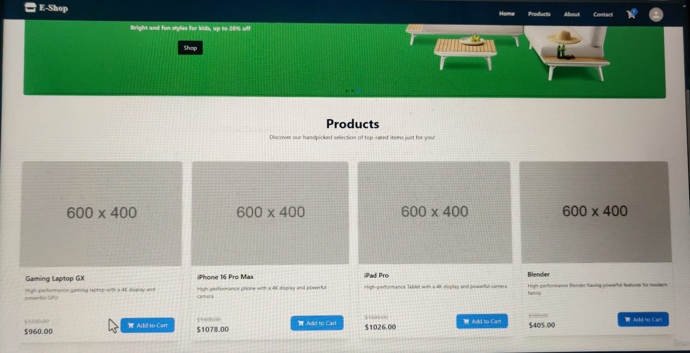
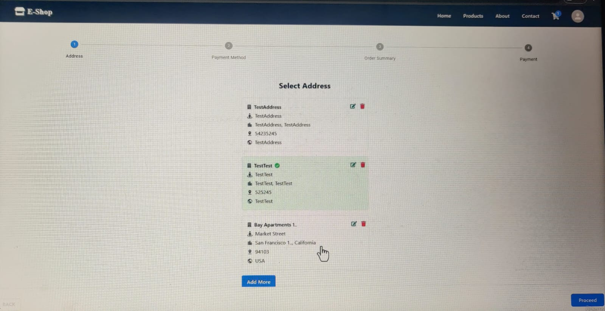
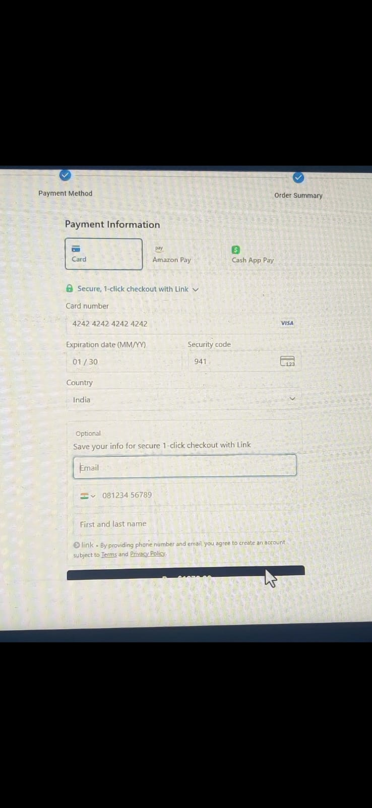

# 🛒 Full-Stack E-Commerce Application

This is a **Full-Stack E-Commerce Project** built with **Spring Boot (backend)** and **React + Vite(frontend)**.  
The system provides complete e-commerce features including product browsing, cart management, authentication, address handling, and payment integration.  
APIs are tested using **Postman**.

---

## 📸 Project Screenshots

### 🏠 Home Page  
  
➡️ Displays all available products fetched from the Spring Boot API.

---

### 🔑 User Login  
  
➡️ Users can log in with credentials. Authentication APIs are handled by Spring Boot.

---

### 📦 Address Page  
  
➡️ Users can add/update delivery addresses. The backend API stores and retrieves address data.

---

### 💳 Payment Page  
  
➡️ Integrated payment workflow. API processes order and payment details securely.

---

### ✅ Final Checkout  
  
➡️ Order summary is displayed. Confirms product, address, and payment information.

---

## 🚀 How to Run the Project

### 🔹 Backend (Spring Boot)
1. Clone the repository and navigate to the backend folder  
   ```bash
   git clone https://github.com/keerthi-0235/ecom-backend.git
   cd ecom-backend
2.Configure database in application.properties

3.Run the application


mvn spring-boot:run
4.APIs will be available at


http://localhost:8080/api
🔹 Frontend (React + Vite)
1.Navigate to the frontend folder


cd ecom-frontend1
2.Install dependencies


npm install
3.Start development server


npm run dev
4.Visit in browser:
http://localhost:5173/

🛠️ Tech Stack
Backend: Spring Boot, Spring Data JPA, REST APIs, MySQL/H2

Frontend: React, Vite, 

API Testing: Postman

Build Tool: Maven, npm

🔮 Features
Product browsing with images and details (via API)

User login and authentication

Add to cart functionality

Address management

Payment integration

Order confirmation
# React + Vite

This template provides a minimal setup to get React working in Vite with HMR and some ESLint rules.

Currently, two official plugins are available:

- [@vitejs/plugin-react](https://github.com/vitejs/vite-plugin-react/blob/main/packages/plugin-react/README.md) uses [Babel](https://babeljs.io/) for Fast Refresh
- [@vitejs/plugin-react-swc](https://github.com/vitejs/vite-plugin-react-swc) uses [SWC](https://swc.rs/) for Fast Refresh
